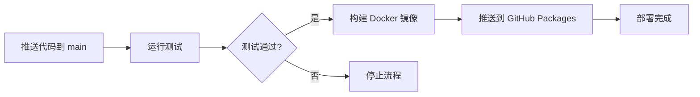

# 🚀 GitHub Packages 部署指南

## 📋 概述

本项目配置了完整的 CI/CD 流程，会自动将 Docker 镜像发布到 **GitHub Container Registry (ghcr.io)**。

## 🔄 自动部署流程

### 1️⃣ 代码推送触发



### 2️⃣ 触发条件

| 事件 | 分支/标签 | 构建镜像 | 标签 |
|------|---------|---------|------|
| Push | `main` | ✅ | `latest`, `sha-abc1234` |
| Push | `develop` | ❌ | - |
| Tag | `v*` (如 `v1.0.0`) | ✅ | `v1.0.0`, `1.0.0`, `1.0`, `1` |
| Pull Request | 任意 | ❌ | - |
| 手动触发 | 任意 | ✅ | 自定义标签 |

## 🛠️ 首次设置

### 1. 启用 GitHub Packages

GitHub Packages 默认已启用，无需额外配置。

### 2. 配置包可见性

1. 进入仓库的 **Settings** → **Packages**
2. 选择 `smart_test` 包
3. 设置为 **Public** (推荐) 或 **Private**

### 3. 配置包权限 (私有包)

如果包是私有的，需要创建 Personal Access Token (PAT)：

1. 访问 https://github.com/settings/tokens
2. 点击 **Generate new token** → **Generate new token (classic)**
3. 设置权限：
   - ✅ `read:packages` - 拉取镜像
   - ✅ `write:packages` - 推送镜像 (CI/CD 自动处理)
4. 生成并保存 Token

## 📦 发布新版本

### 方法 1: 推送到 main 分支 (自动)

```bash
# 1. 确保所有测试通过
go test ./...

# 2. 提交并推送代码
git add .
git commit -m "feat: new feature"
git push origin main
```

推送后会自动：
- ✅ 运行后端测试
- ✅ 运行前端测试
- ✅ 构建 Docker 镜像
- ✅ 推送标签: `latest`, `sha-<commit>`

### 方法 2: 创建版本标签 (语义化版本)

```bash
# 1. 创建并推送标签
git tag v1.0.0
git push origin v1.0.0
```

推送后会自动：
- ✅ 运行所有测试
- ✅ 构建 Docker 镜像
- ✅ 推送多个标签:
  - `v1.0.0` (完整版本)
  - `1.0.0` (无 v 前缀)
  - `1.0` (主+次版本)
  - `1` (主版本)

### 方法 3: 手动触发构建

1. 访问 **Actions** → **Docker Build (Manual)**
2. 点击 **Run workflow**
3. 选择分支并输入自定义标签
4. 点击 **Run workflow** 开始构建

## 📊 监控部署状态

### 查看 GitHub Actions 运行状态

```bash
# 在浏览器中打开
https://github.com/liulingyuncat/SMART_TEST/actions
```

### 查看已发布的镜像

```bash
# 在浏览器中打开
https://github.com/liulingyuncat/SMART_TEST/pkgs/container/smart_test
```

### 使用 GitHub CLI

```bash
# 查看最近的 workflow 运行
gh run list --workflow=ci.yml

# 查看特定运行的详情
gh run view <run-id>

# 查看日志
gh run view <run-id> --log
```

## 🐳 拉取和使用镜像

### 公开镜像 (无需认证)

```bash
# 拉取最新版本
docker pull ghcr.io/liulingyuncat/smart_test:latest

# 拉取特定版本
docker pull ghcr.io/liulingyuncat/smart_test:v1.0.0

# 运行容器
docker run -d -p 8443:8443 ghcr.io/liulingyuncat/smart_test:latest
```

### 私有镜像 (需要认证)

```bash
# 使用 PAT 登录
echo $GITHUB_TOKEN | docker login ghcr.io -u USERNAME --password-stdin

# 拉取镜像
docker pull ghcr.io/liulingyuncat/smart_test:latest
```

## 🔧 CI/CD 工作流文件

### 主 CI/CD 流程
- 文件: `.github/workflows/ci.yml`
- 功能: 测试 + 构建 + 部署
- 触发: Push (main/develop), PR, Tag

### 手动构建流程
- 文件: `.github/workflows/docker-build.yml`
- 功能: 仅构建镜像
- 触发: 手动触发

## 🐛 故障排查

### 1. 构建失败

**检查构建日志：**
```bash
gh run list --workflow=ci.yml --limit 1
gh run view --log
```

**常见问题：**
- ❌ 测试失败 → 修复测试并重新推送
- ❌ Docker 构建失败 → 检查 Dockerfile
- ❌ 权限错误 → 检查 `GITHUB_TOKEN` 权限

### 2. 无法拉取镜像

**问题：`denied: permission_denied`**

解决方案：
```bash
# 确认镜像是公开的，或使用 PAT 登录
docker login ghcr.io -u USERNAME
```

**问题：`manifest unknown`**

解决方案：
- 检查标签是否存在
- 访问 Packages 页面确认镜像已发布

### 3. 镜像版本不更新

**清理本地缓存：**
```bash
# 删除旧镜像
docker rmi ghcr.io/liulingyuncat/smart_test:latest

# 强制拉取最新
docker pull ghcr.io/liulingyuncat/smart_test:latest --no-cache
```

## 📈 最佳实践

### 1. 版本管理

```bash
# 开发版本
v0.1.0-alpha
v0.1.0-beta

# 发布版本
v1.0.0
v1.1.0
v1.1.1

# 紧急修复
v1.0.1
```

### 2. 测试策略

```bash
# 推送到 develop 分支进行测试（不会构建镜像）
git push origin develop

# 确认无误后合并到 main（会构建镜像）
git checkout main
git merge develop
git push origin main
```

### 3. 回滚版本

```bash
# 拉取旧版本镜像
docker pull ghcr.io/liulingyuncat/smart_test:v1.0.0

# 更新 docker-compose.yml
image: ghcr.io/liulingyuncat/smart_test:v1.0.0

# 重启服务
docker-compose up -d
```

## 📚 相关文档

- [Docker 使用指南](./DOCKER.md)
- [CI/CD 工作流配置](./.github/workflows/ci.yml)
- [Dockerfile](./Dockerfile)
- [GitHub Packages 文档](https://docs.github.com/en/packages)

## 🔗 快速链接

- **Actions 页面**: https://github.com/liulingyuncat/SMART_TEST/actions
- **Packages 页面**: https://github.com/liulingyuncat/SMART_TEST/pkgs/container/smart_test
- **Releases 页面**: https://github.com/liulingyuncat/SMART_TEST/releases

## 💡 提示

- 💚 每次推送到 main 都会触发完整的 CI/CD 流程
- 🏷️ 使用语义化版本标签管理发布版本
- 🔒 生产环境建议使用具体版本号，避免使用 `latest`
- 📊 定期查看 Actions 运行状态，确保构建成功
- 🐳 使用 Docker Compose 简化部署流程
