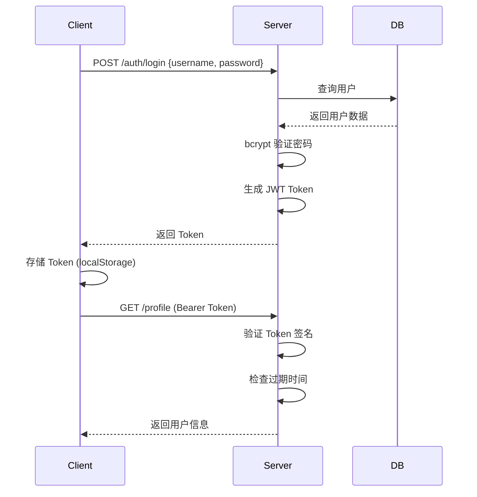

# Web 智能测试平台 API 文档

## 基本信息

- **Base URL**: `http://localhost:8080/api/v1`
- **协议**: HTTP/HTTPS
- **认证方式**: JWT Bearer Token
- **请求格式**: `application/json`
- **响应格式**: `application/json`

## 通用响应结构

### 成功响应
```json
{
  "code": 0,
  "message": "success",
  "data": {
    // 业务数据
  }
}
```

### 错误响应
```json
{
  "code": 400,  // HTTP 状态码
  "message": "错误描述信息"
}
```

## 认证相关 API

### 1. 用户登录

**接口**: `POST /auth/login`

**描述**: 用户使用用户名和密码登录,成功后返回 JWT Token

**请求参数**:
```json
{
  "username": "admin",      // 必填, 3-50 字符
  "password": "admin123"    // 必填, 6-50 字符
}
```

**参数校验**:
| 字段     | 类型   | 必填 | 规则                       | 说明     |
|----------|--------|------|----------------------------|----------|
| username | string | 是   | required, min:3, max:50    | 用户名   |
| password | string | 是   | required, min:6, max:50    | 密码     |

**成功响应** (200):
```json
{
  "code": 0,
  "message": "success",
  "data": {
    "token": "eyJhbGciOiJIUzI1NiIsInR5cCI6IkpXVCJ9..."
  }
}
```

**错误响应**:

- **400 Bad Request** - 参数验证失败
```json
{
  "code": 400,
  "message": "invalid request parameters: Key: 'LoginRequest.Username' Error:Field validation for 'Username' failed on the 'required' tag"
}
```

- **401 Unauthorized** - 用户名或密码错误
```json
{
  "code": 401,
  "message": "invalid username or password"
}
```

- **500 Internal Server Error** - 服务器内部错误
```json
{
  "code": 500,
  "message": "internal server error"
}
```

**Token 说明**:
- **算法**: HS256
- **有效期**: 24 小时
- **Payload 结构**:
```json
{
  "sub": "admin",           // 用户名
  "exp": 1730505600,        // 过期时间 (Unix 时间戳)
  "iat": 1730419200,        // 签发时间
  "iss": "webtest"          // 签发者
}
```

**请求示例** (curl):
```bash
curl -X POST http://localhost:8080/api/v1/auth/login \
  -H "Content-Type: application/json" \
  -d '{
    "username": "admin",
    "password": "admin123"
  }'
```

**请求示例** (JavaScript):
```javascript
const response = await fetch('http://localhost:8080/api/v1/auth/login', {
  method: 'POST',
  headers: {
    'Content-Type': 'application/json',
  },
  body: JSON.stringify({
    username: 'admin',
    password: 'admin123',
  }),
});
const data = await response.json();
console.log(data.data.token);
```

---

### 2. 获取当前用户信息

**接口**: `GET /profile`

**描述**: 获取当前登录用户的个人信息(需要认证)

**请求头**:
```
Authorization: Bearer <token>
```

**请求参数**: 无

**成功响应** (200):
```json
{
  "username": "admin",
  "message": "authenticated user profile"
}
```

**错误响应**:

- **401 Unauthorized** - Token 缺失或无效
```json
{
  "code": 401,
  "message": "authorization header required"
}
```

```json
{
  "code": 401,
  "message": "invalid authorization format"
}
```

```json
{
  "code": 401,
  "message": "invalid or expired token"
}
```

**请求示例** (curl):
```bash
TOKEN="eyJhbGciOiJIUzI1NiIsInR5cCI6IkpXVCJ9..."

curl http://localhost:8080/api/v1/profile \
  -H "Authorization: Bearer $TOKEN"
```

**请求示例** (JavaScript):
```javascript
const token = localStorage.getItem('auth_token');

const response = await fetch('http://localhost:8080/api/v1/profile', {
  headers: {
    'Authorization': `Bearer ${token}`,
  },
});
const data = await response.json();
```

---

## 认证机制

### JWT Token 使用流程



### Token 刷新策略

当前版本 Token 有效期为 24 小时,到期后需重新登录。

**建议优化** (未来版本):
- 实现 Refresh Token 机制
- Access Token 短期(15分钟)
- Refresh Token 长期(7天)

---

## 中间件

### AuthMiddleware

**功能**: 验证 JWT Token,保护需要认证的路由

**处理流程**:
1. 从请求头 `Authorization` 提取 Token
2. 验证格式为 `Bearer <token>`
3. 解析和验证 Token 签名
4. 检查过期时间
5. 将用户名存入 Context: `c.Set("username", claims.Subject)`
6. 继续后续处理器

**使用示例**:
```go
protected := api.Group("")
protected.Use(middleware.AuthMiddleware(authService))
{
    protected.GET("/profile", profileHandler)
}
```

### RequireRole

**功能**: 检查用户角色权限

**参数**: `allowedRoles ...string`

**使用示例**:
```go
admin := api.Group("/admin")
admin.Use(middleware.AuthMiddleware(authService))
admin.Use(middleware.RequireRole("admin"))
{
    admin.GET("/users", listUsersHandler)
}
```

---

## 错误码说明

| HTTP 状态码 | 含义                 | 典型场景                     |
|-------------|----------------------|------------------------------|
| 200         | 成功                 | 请求正常处理                 |
| 400         | 请求参数错误         | 验证失败、参数缺失           |
| 401         | 未授权               | Token 无效、密码错误         |
| 403         | 权限不足             | 角色不匹配                   |
| 500         | 服务器内部错误       | 数据库错误、未捕获异常       |

---

## 安全性说明

### 密码安全
- 使用 bcrypt 加密存储 (cost=10)
- 登录失败不泄露用户是否存在
- 建议实现登录失败次数限制

### Token 安全
- 使用 HS256 签名算法
- 生产环境必须修改 `JWT_SECRET`
- Token 应通过 HTTPS 传输
- 客户端存储在 localStorage (考虑升级到 httpOnly Cookie)

### CORS 配置
生产环境需配置允许的跨域源:
```go
r.Use(cors.New(cors.Config{
    AllowOrigins:     []string{"https://yourdomain.com"},
    AllowMethods:     []string{"GET", "POST", "PUT", "DELETE"},
    AllowHeaders:     []string{"Authorization", "Content-Type"},
    AllowCredentials: true,
}))
```

---

## 环境配置

### 环境变量

| 变量名              | 默认值                               | 说明                          |
|---------------------|--------------------------------------|-------------------------------|
| `DB_TYPE`           | `sqlite`                             | 数据库类型 (postgres/sqlite)  |
| `DB_HOST`           | `localhost`                          | 数据库主机                    |
| `DB_PORT`           | `5432`                               | 数据库端口                    |
| `DB_USER`           | `postgres`                           | 数据库用户名                  |
| `DB_PASSWORD`       | -                                    | 数据库密码                    |
| `DB_NAME`           | `webtest`                            | 数据库名称                    |
| `JWT_SECRET`        | `default_secret_key_...`             | JWT 签名密钥 (生产环境必改)   |
| `SERVER_PORT`       | `8080`                               | HTTP 服务监听端口             |

---

## 测试账号

| 用户名 | 密码     | 角色  | 说明           |
|--------|----------|-------|----------------|
| admin  | admin123 | admin | 系统管理员     |
| root   | root123  | admin | 超级管理员     |

⚠️ **生产环境部署后请立即修改默认密码!**

---

## 版本信息

- **API 版本**: v1
- **文档更新日期**: 2025-01-21
- **后端框架**: Gin v1.9.1
- **Go 版本要求**: 1.21+

---

## 自动化测试用例版本管理 API

### 1. 批量保存版本

**接口**: `POST /projects/:id/auto-cases/versions`

**描述**: 将当前项目的4个ROLE的自动化测试用例全部导出为Excel文件,并创建版本记录

**权限要求**: PM, PM Member

**路径参数**:
| 参数 | 类型 | 必填 | 说明 |
|------|------|------|------|
| id   | int  | 是   | 项目ID |

**请求体**: 无

**响应示例**:
```json
{
  "code": 0,
  "message": "版本保存成功",
  "data": {
    "version_id": "WebTest_20250121_143052",
    "project_name": "WebTest",
    "files": [
      {
        "role_type": "role1",
        "filename": "WebTest_20250121_143052_role1.xlsx",
        "file_path": "storage/versions/auto-cases/WebTest_20250121_143052_role1.xlsx",
        "file_size": 12458,
        "case_count": 35
      },
      {
        "role_type": "role2",
        "filename": "WebTest_20250121_143052_role2.xlsx",
        "file_path": "storage/versions/auto-cases/WebTest_20250121_143052_role2.xlsx",
        "file_size": 8923,
        "case_count": 22
      },
      {
        "role_type": "role3",
        "filename": "WebTest_20250121_143052_role3.xlsx",
        "file_path": "storage/versions/auto-cases/WebTest_20250121_143052_role3.xlsx",
        "file_size": 6745,
        "case_count": 18
      },
      {
        "role_type": "role4",
        "filename": "WebTest_20250121_143052_role4.xlsx",
        "file_path": "storage/versions/auto-cases/WebTest_20250121_143052_role4.xlsx",
        "file_size": 5234,
        "case_count": 15
      }
    ]
  }
}
```

**Excel文件格式**: 19列
- ID, CaseNumber
- ScreenName_CN, FunctionName_CN, Precondition_CN, TestSteps_CN, ExpectedResult_CN
- ScreenName_JP, FunctionName_JP, Precondition_JP, TestSteps_JP, ExpectedResult_JP
- ScreenName_EN, FunctionName_EN, Precondition_EN, TestSteps_EN, ExpectedResult_EN
- TestResult, Remark

**错误码**:
- 400: 项目不存在
- 403: 权限不足
- 500: 文件创建失败或数据库保存失败

---

### 2. 获取版本列表

**接口**: `GET /projects/:id/auto-cases/versions`

**描述**: 获取项目的版本历史列表,支持分页

**权限要求**: PM, PM Member

**路径参数**:
| 参数 | 类型 | 必填 | 说明 |
|------|------|------|------|
| id   | int  | 是   | 项目ID |

**查询参数**:
| 参数 | 类型 | 必填 | 默认值 | 说明 |
|------|------|------|--------|------|
| page | int  | 否   | 1      | 页码 |
| size | int  | 否   | 10     | 每页记录数 |

**响应示例**:
```json
{
  "code": 0,
  "message": "success",
  "data": {
    "versions": [
      {
        "version_id": "WebTest_20250121_143052",
        "project_name": "WebTest",
        "remark": "v1.0 基线版本",
        "created_at": "2025-01-21T14:30:52+08:00",
        "files": [
          {
            "role_type": "role1",
            "filename": "WebTest_20250121_143052_role1.xlsx",
            "file_size": 12458,
            "case_count": 35
          },
          {
            "role_type": "role2",
            "filename": "WebTest_20250121_143052_role2.xlsx",
            "file_size": 8923,
            "case_count": 22
          },
          {
            "role_type": "role3",
            "filename": "WebTest_20250121_143052_role3.xlsx",
            "file_size": 6745,
            "case_count": 18
          },
          {
            "role_type": "role4",
            "filename": "WebTest_20250121_143052_role4.xlsx",
            "file_size": 5234,
            "case_count": 15
          }
        ]
      }
    ],
    "total": 5,
    "page": 1,
    "size": 10
  }
}
```

---

### 3. 下载版本压缩包

**接口**: `GET /projects/:id/auto-cases/versions/:versionId/export`

**描述**: 将指定版本的4个Excel文件打包成zip并下载

**权限要求**: PM, PM Member

**路径参数**:
| 参数 | 类型 | 必填 | 说明 |
|------|------|------|------|
| id        | int    | 是   | 项目ID |
| versionId | string | 是   | 版本ID |

**响应**: application/zip 二进制流

**响应头**:
```
Content-Type: application/zip
Content-Disposition: attachment; filename="版本ID.zip"
```

**文件结构**:
```
WebTest_20250121_143052.zip
├── WebTest_20250121_143052_role1.xlsx
├── WebTest_20250121_143052_role2.xlsx
├── WebTest_20250121_143052_role3.xlsx
└── WebTest_20250121_143052_role4.xlsx
```

**错误码**:
- 400: 版本ID非法或文件不存在
- 403: 权限不足
- 500: zip创建失败

---

### 4. 删除版本

**接口**: `DELETE /projects/:id/auto-cases/versions/:versionId`

**描述**: 删除指定版本的所有文件和数据库记录

**权限要求**: PM, PM Member

**路径参数**:
| 参数 | 类型 | 必填 | 说明 |
|------|------|------|------|
| id        | int    | 是   | 项目ID |
| versionId | string | 是   | 版本ID |

**请求体**: 无

**响应示例**:
```json
{
  "code": 0,
  "message": "版本删除成功"
}
```

**删除内容**:
- 4个Excel物理文件
- auto_test_case_versions表中4条记录

**错误码**:
- 400: 版本不存在
- 403: 权限不足
- 500: 文件删除失败

---

### 5. 更新版本备注

**接口**: `PUT /projects/:id/auto-cases/versions/:versionId/remark`

**描述**: 批量更新同一版本ID的4条记录的备注

**权限要求**: PM, PM Member

**路径参数**:
| 参数 | 类型 | 必填 | 说明 |
|------|------|------|------|
| id        | int    | 是   | 项目ID |
| versionId | string | 是   | 版本ID |

**请求体**:
```json
{
  "remark": "v1.1 修复登录问题"
}
```

**参数校验**:
| 字段   | 类型   | 必填 | 长度限制 | 说明 |
|--------|--------|------|----------|------|
| remark | string | 是   | ≤200字符 | 版本备注 |

**响应示例**:
```json
{
  "code": 0,
  "message": "备注更新成功"
}
```

**错误码**:
- 400: 备注长度超过200字符
- 403: 权限不足
- 404: 版本不存在
- 500: 数据库更新失败

---

## 接口测试用例管理 API (T14)

### 1. 获取接口测试用例列表

**接口**: `GET /projects/:id/api-cases`

**描述**: 分页查询指定项目和类型的接口测试用例列表,按display_order升序排序

**权限要求**: PM, PM Member

**路径参数**:
| 参数 | 类型 | 必填 | 说明 |
|------|------|------|------|
| id   | int  | 是   | 项目ID |

**Query参数**:
| 参数      | 类型   | 必填 | 默认值 | 说明 |
|-----------|--------|------|--------|------|
| case_type | string | 是   | -      | 用例类型:role1/role2/role3/role4 |
| page      | int    | 否   | 1      | 页码 |
| size      | int    | 否   | 10     | 每页数量 |

**响应示例**:
```json
{
  "code": 0,
  "message": "success",
  "data": {
    "cases": [
      {
        "id": "550e8400-e29b-41d4-a716-446655440000",
        "project_id": 1,
        "case_type": "role1",
        "case_number": "API-001",
        "screen": "用户管理",
        "url": "/api/v1/users",
        "header": "Content-Type: application/json\nAuthorization: Bearer xxx",
        "method": "GET",
        "body": "",
        "response": "{\"code\":0,\"data\":[]}",
        "test_result": "OK",
        "remark": "获取用户列表",
        "display_order": 1,
        "created_at": "2025-01-20T10:00:00Z",
        "updated_at": "2025-01-20T10:00:00Z"
      }
    ],
    "total": 42,
    "page": 1,
    "size": 10
  }
}
```

**错误码**:
- 400: 参数验证失败(case_type非法)
- 403: 无项目访问权限
- 500: 数据库查询失败

---

### 2. 插入接口测试用例

**接口**: `POST /projects/:id/api-cases/insert`

**描述**: 在指定位置插入新用例,自动调整display_order

**权限要求**: PM, PM Member

**路径参数**:
| 参数 | 类型 | 必填 | 说明 |
|------|------|------|------|
| id   | int  | 是   | 项目ID |

**请求体**:
```json
{
  "target_case_id": "550e8400-e29b-41d4-a716-446655440000",
  "position": "after",
  "case_data": {
    "case_type": "role1",
    "case_number": "API-002",
    "screen": "登录模块",
    "url": "/api/v1/auth/login",
    "header": "Content-Type: application/json",
    "method": "POST",
    "body": "{\"username\":\"test\",\"password\":\"123456\"}",
    "response": "{\"code\":0,\"data\":{\"token\":\"xxx\"}}",
    "test_result": "NR",
    "remark": "用户登录"
  }
}
```

**参数说明**:
| 字段           | 类型   | 必填 | 说明 |
|----------------|--------|------|------|
| target_case_id | string | 是   | 目标用例UUID |
| position       | string | 是   | 插入位置:before/after |
| case_data      | object | 是   | 用例数据 |
| method         | string | 是   | HTTP方法:GET/POST/PUT/DELETE/PATCH |
| test_result    | string | 是   | 测试结果:NR/OK/NG |

**响应示例**:
```json
{
  "code": 0,
  "message": "插入成功",
  "data": {
    "id": "660e8400-e29b-41d4-a716-446655440111",
    "display_order": 3
  }
}
```

**业务逻辑**:
1. 根据target_case_id查询目标用例的display_order
2. 计算新用例display_order(before=原值,after=原值+1)
3. 批量更新后续用例display_order+1
4. 生成新UUID作为id主键
5. 创建新用例
6. 重新分配所有用例display_order为连续序号

**错误码**:
- 400: 参数验证失败,method或test_result非法
- 403: 无项目访问权限
- 404: 目标用例不存在
- 500: 数据库操作失败

---

### 3. 批量删除接口测试用例

**接口**: `POST /projects/:id/api-cases/batch-delete`

**描述**: 批量删除用例并重新分配display_order

**权限要求**: PM, PM Member

**路径参数**:
| 参数 | 类型 | 必填 | 说明 |
|------|------|------|------|
| id   | int  | 是   | 项目ID |

**请求体**:
```json
{
  "case_type": "role1",
  "case_ids": [
    "550e8400-e29b-41d4-a716-446655440000",
    "660e8400-e29b-41d4-a716-446655440111"
  ]
}
```

**响应示例**:
```json
{
  "code": 0,
  "message": "批量删除成功",
  "data": {
    "deleted_count": 2,
    "failed_ids": []
  }
}
```

**业务逻辑**:
1. 循环删除每个UUID对应的用例
2. 删除后重新分配display_order为连续序号(1,2,3...)
3. 返回删除数量和失败的UUID列表

**错误码**:
- 400: case_ids为空或格式错误
- 403: 无项目访问权限
- 500: 数据库操作失败

---

### 4. 更新接口测试用例

**接口**: `PATCH /projects/:id/api-cases/:caseId`

**描述**: 更新指定用例的字段

**权限要求**: PM, PM Member

**路径参数**:
| 参数   | 类型   | 必填 | 说明 |
|--------|--------|------|------|
| id     | int    | 是   | 项目ID |
| caseId | string | 是   | 用例UUID |

**请求体**:
```json
{
  "case_number": "API-003",
  "url": "/api/v1/users/profile",
  "method": "PUT",
  "test_result": "OK"
}
```

**响应示例**:
```json
{
  "code": 0,
  "message": "更新成功"
}
```

**错误码**:
- 400: 字段验证失败
- 403: 无项目访问权限
- 404: 用例不存在
- 500: 数据库更新失败

---

### 5. 保存版本

**接口**: `POST /projects/:id/api-cases/versions`

**描述**: 导出ROLE1-4所有用例为4个CSV文件,创建版本记录

**权限要求**: PM, PM Member

**路径参数**:
| 参数 | 类型 | 必填 | 说明 |
|------|------|------|------|
| id   | int  | 是   | 项目ID |

**请求体**: 无

**响应示例**:
```json
{
  "code": 0,
  "message": "版本保存成功",
  "data": {
    "version_id": "770e8400-e29b-41d4-a716-446655440222",
    "filenames": [
      "WebTest_APITestCase_ROLE1_20250120_143052.csv",
      "WebTest_APITestCase_ROLE2_20250120_143052.csv",
      "WebTest_APITestCase_ROLE3_20250120_143052.csv",
      "WebTest_APITestCase_ROLE4_20250120_143052.csv"
    ]
  }
}
```

**CSV格式**:
- 表头: No.,用例编号,画面,URL,Header,Method,Body,Response,测试结果,备考
- No.列: 基于display_order排序后的序号(1,2,3...)
- 存储路径: `storage/versions/api-cases/{filename}`

**错误码**:
- 403: 无项目访问权限
- 500: 文件生成或数据库操作失败

---

### 6. 获取版本列表

**接口**: `GET /projects/:id/api-cases/versions`

**描述**: 分页查询版本列表

**权限要求**: PM, PM Member

**路径参数**:
| 参数 | 类型 | 必填 | 说明 |
|------|------|------|------|
| id   | int  | 是   | 项目ID |

**Query参数**:
| 参数 | 类型 | 必填 | 默认值 | 说明 |
|------|------|------|--------|------|
| page | int  | 否   | 1      | 页码 |
| size | int  | 否   | 10     | 每页数量 |

**响应示例**:
```json
{
  "code": 0,
  "message": "success",
  "data": {
    "versions": [
      {
        "id": "770e8400-e29b-41d4-a716-446655440222",
        "project_id": 1,
        "filename_role1": "WebTest_APITestCase_ROLE1_20250120_143052.csv",
        "filename_role2": "WebTest_APITestCase_ROLE2_20250120_143052.csv",
        "filename_role3": "WebTest_APITestCase_ROLE3_20250120_143052.csv",
        "filename_role4": "WebTest_APITestCase_ROLE4_20250120_143052.csv",
        "remark": "v1.0初版",
        "created_by": 1,
        "created_at": "2025-01-20T14:30:52Z",
        "updated_at": "2025-01-20T14:30:52Z"
      }
    ],
    "total": 5,
    "page": 1,
    "size": 10
  }
}
```

**错误码**:
- 403: 无项目访问权限
- 500: 数据库查询失败

---

### 7. 下载版本

**接口**: `GET /projects/:id/api-cases/versions/:versionId/export`

**描述**: 下载版本的ZIP压缩包(包含4个CSV文件)

**权限要求**: PM, PM Member

**路径参数**:
| 参数      | 类型   | 必填 | 说明 |
|-----------|--------|------|------|
| id        | int    | 是   | 项目ID |
| versionId | string | 是   | 版本UUID |

**响应**: application/zip 二进制流

**响应头**:
```
Content-Type: application/zip
Content-Disposition: attachment; filename="WebTest_APITestCase_20250120_143052.zip"
```

**ZIP文件结构**:
```
WebTest_APITestCase_20250120_143052.zip
├── WebTest_APITestCase_ROLE1_20250120_143052.csv
├── WebTest_APITestCase_ROLE2_20250120_143052.csv
├── WebTest_APITestCase_ROLE3_20250120_143052.csv
└── WebTest_APITestCase_ROLE4_20250120_143052.csv
```

**错误码**:
- 400: 版本ID非法
- 403: 无项目访问权限
- 404: 版本不存在或文件不存在
- 500: ZIP创建失败

---

### 8. 删除版本

**接口**: `DELETE /projects/:id/api-cases/versions/:versionId`

**描述**: 删除版本记录和对应的4个CSV文件

**权限要求**: PM, PM Member

**路径参数**:
| 参数      | 类型   | 必填 | 说明 |
|-----------|--------|------|------|
| id        | int    | 是   | 项目ID |
| versionId | string | 是   | 版本UUID |

**请求体**: 无

**响应示例**:
```json
{
  "code": 0,
  "message": "版本删除成功"
}
```

**删除内容**:
- 4个CSV物理文件
- api_test_case_versions表中1条记录

**错误码**:
- 403: 无项目访问权限
- 404: 版本不存在
- 500: 文件删除或数据库操作失败

---

### 9. 更新版本备注

**接口**: `PUT /projects/:id/api-cases/versions/:versionId/remark`

**描述**: 更新版本备注字段

**权限要求**: PM, PM Member

**路径参数**:
| 参数      | 类型   | 必填 | 说明 |
|-----------|--------|------|------|
| id        | int    | 是   | 项目ID |
| versionId | string | 是   | 版本UUID |

**请求体**:
```json
{
  "remark": "v1.1 修复登录接口问题"
}
```

**参数校验**:
| 字段   | 类型   | 必填 | 长度限制 | 说明 |
|--------|--------|------|----------|------|
| remark | string | 是   | ≤500字符 | 版本备注 |

**响应示例**:
```json
{
  "code": 0,
  "message": "备注更新成功"
}
```

**错误码**:
- 400: 备注长度超过500字符
- 403: 无项目访问权限
- 404: 版本不存在
- 500: 数据库更新失败

---

## 联系方式

- **项目仓库**: https://github.com/yourorg/webtest
- **问题反馈**: https://github.com/yourorg/webtest/issues
- **技术支持**: support@example.com

