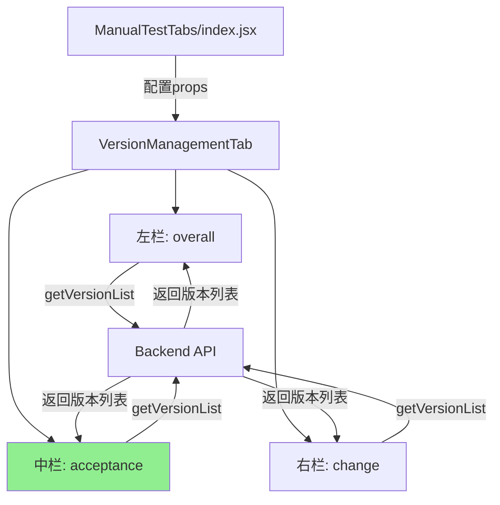

# T37 - VersionManagementTab 三栏布局功能验证设计

## 1. 概述 (Overview)

### 1.1. 设计目标
验证 `VersionManagementTab` 组件的三栏布局功能完整性,确认中间栏(受入用例版本)在手动测试模块中的显示和交互正常工作。

### 1.2. 背景
`VersionManagementTab` 组件已完整实现三栏布局支持:
- **代码实现**: 包含 `middleDocType` 参数、`loadMiddleVersions` 方法、条件渲染逻辑(第330-357行)
- **配置就绪**: `ManualTestTabs/index.jsx` 已配置 `middleDocType: 'acceptance'`(第28行)
- **后端支持**: `/api/versions` 接口支持 `acceptance` 类型过滤

**当前状态**: 功能已实现但未经验证,需确认是否存在隐藏问题(如数据为空、API路径错误等)。

### 1.3. 范围
- **包含**: 
  - 验证三栏独立加载是否正常(网络请求、数据渲染)
  - 验证中间栏的交互功能(下载、删除、编辑备注)
  - 确认空数据状态的友好提示
- **不包含**:
  - 代码逻辑修改(现有实现已完整)
  - 后端API新增(已支持 `acceptance` 类型)
  - UI样式调整

## 2. 总体设计 (High-Level Design)

### 2.1. 模块定位
`VersionManagementTab` 是一个通用的前端展示组件,位于手动测试、需求管理、接口测试等模块中,负责展示和管理项目版本列表。本次设计聚焦于手动测试模块(`ManualTestTabs`)的三栏布局启用。

### 2.2. 架构图


### 2.3. 核心流程(已实现)
1. **Props传递**: `ManualTestTabs/index.jsx` 第28行配置传入 `middleDocType='acceptance'`
2. **并行加载**: `useEffect` 第42-45行同时触发三个独立的加载函数
3. **条件渲染**: 第330行通过 `{middleDocType && ...}` 判断是否渲染中间栏
4. **交互隔离**: 第145-157行 `handleDelete` 根据 `side` 参数刷新指定栏

## 3. 详细设计 (Detailed Design)

### 3.1. 组件/函数详述

#### 3.1.1. VersionManagementTab 组件
**职责**: 接收配置Props,管理三栏版本列表的独立状态,提供版本操作交互。

**关键状态**:
- `leftVersions / middleVersions / rightVersions`: 各栏版本数组
- `leftLoading / middleLoading / rightLoading`: 各栏加载状态
- `editModalVisible / editingVersion / editingRemark`: 备注编辑状态

**核心方法**:
- `loadLeftVersions()`: 加载左栏版本,条件:`projectId` 非空
- `loadMiddleVersions()`: 加载中栏版本,条件:`projectId` 和 `middleDocType` 非空
- `loadRightVersions()`: 加载右栏版本,条件:`projectId` 和 `rightDocType` 非空
- `handleDelete(versionID, side)`: 删除指定版本,根据 `side` 参数刷新对应栏

### 3.2. 接口定义 (API)

#### 3.2.1. 对外接口(Props)
```typescript
interface VersionManagementTabProps {
  projectId: string | number;        // 必填: 项目ID
  leftDocType?: string;              // 左栏文档类型(默认'overall')
  middleDocType?: string;            // 中栏文档类型(可选,undefined则不显示)
  rightDocType?: string;             // 右栏文档类型(可选,undefined则不显示)
  leftTitle?: string;                // 左栏标题
  middleTitle?: string;              // 中栏标题
  rightTitle?: string;               // 右栏标题
  apiModule?: APIModule;             // API模块(默认manualCase API)
}
```

#### 3.2.2. 内部接口
- `getVersionList(projectId, docType)`: 获取版本列表,返回 `Array<Version>`
- `downloadVersion(projectId, versionID)`: 下载版本文件
- `deleteVersion(projectId, versionID)`: 删除版本记录
- `updateVersionRemark(projectId, versionID, remark)`: 更新版本备注

### 3.3. 数据模型

#### 3.3.1. Version 数据结构
```typescript
interface Version {
  id: number | string;               // 版本ID
  filename: string;                  // 文件名
  doc_type?: string;                 // 文档类型
  file_size?: number;                // 文件大小(字节)
  created_at: string;                // 创建时间(ISO格式)
  remark?: string;                   // 备注
  
  // 接口用例特有字段(四个文件)
  filename_role1?: string;
  filename_role2?: string;
  filename_role3?: string;
  filename_role4?: string;
}
```

### 3.4. 验证要点

#### 3.4.1. 数据加载验证
**检查项**:
- API请求是否成功发送(`/projects/:id/versions?case_type=acceptance`)
- 后端是否存在 `acceptance` 类型的版本记录
- 空数据时是否显示"暂无版本记录"提示(第347行 `Empty` 组件)

#### 3.4.2. 交互功能验证
**检查项**:
- 下载按钮是否触发正确的API调用(`handleDownload` 第136行)
- 删除后是否仅刷新中间栏(`handleDelete` 第149行 `side='middle'`)
- 备注编辑是否正常保存(`handleSaveRemark` 第174行)

## 4. 关键非功能性设计 (Key Non-Functional Design)

### 4.1. 错误处理
- **API调用失败**: 捕获异常,显示 Ant Design `message.error`,不阻塞其他栏加载
- **空数据处理**: 使用 `Array.isArray(data) ? data : []` 防御性编程,避免非数组响应导致崩溃
- **参数缺失**: `loadMiddleVersions` 在 `middleDocType` 或 `projectId` 为空时提前返回,输出日志

### 4.2. 日志与监控
- **加载日志**: 每栏加载时输出 `console.log`,包含 `projectId` 和 `docType`
- **响应日志**: 输出API返回数据类型和长度,便于排查数据格式问题
- **错误日志**: 使用 `console.error` 记录加载失败的详细信息

### 4.3. 性能优化
- **并行加载**: 三栏版本列表通过独立的 `useEffect` 并发请求,无阻塞依赖
- **分页支持**: 每栏表格默认 `pageSize=5`,支持切换 `5/10/20` 条/页,减少初始渲染量
- **按需渲染**: 仅当 `middleDocType` / `rightDocType` 非空时渲染对应栏,避免无效DOM

## 5. 验证方案与风险 (Verification & Risks)

### 5.1. 验证步骤
1. **启动项目**: 访问手动测试模块的"版本管理"Tab
2. **观察网络**: 确认发送三个 `getVersionList` 请求(overall/acceptance/change)
3. **检查渲染**: 确认页面显示三个垂直排列的Card组件
4. **测试交互**: 对中间栏执行下载、删除、编辑备注操作
5. **验证隔离**: 确认中间栏操作不影响左右栏数据

### 5.2. 潜在问题
1. **无数据场景**: 若系统中无 `acceptance` 版本记录,中栏显示空状态(已有 `Empty` 兜底,第347行)
2. **API兼容性**: 后端已支持 `acceptance` 类型(`version_handler.go` 第38行,`manual_test_case_service.go` 第79行)
3. **Props透传**: 已验证第93行使用 `{ ...(tab.props || {}) }` 正确展开配置

### 5.3. 预期结果
- **成功场景**: 三栏正常显示,各栏独立加载和交互
- **空数据场景**: 中栏显示"暂无版本记录",不影响左右栏
- **错误场景**: API失败时显示错误提示,不阻塞其他栏

---

**设计完成时间**: 2025-11-25  
**设计版本**: v1.1(已修正为验证类设计)  
**设计负责人**: GitHub Copilot (Claude Sonnet 4.5)
